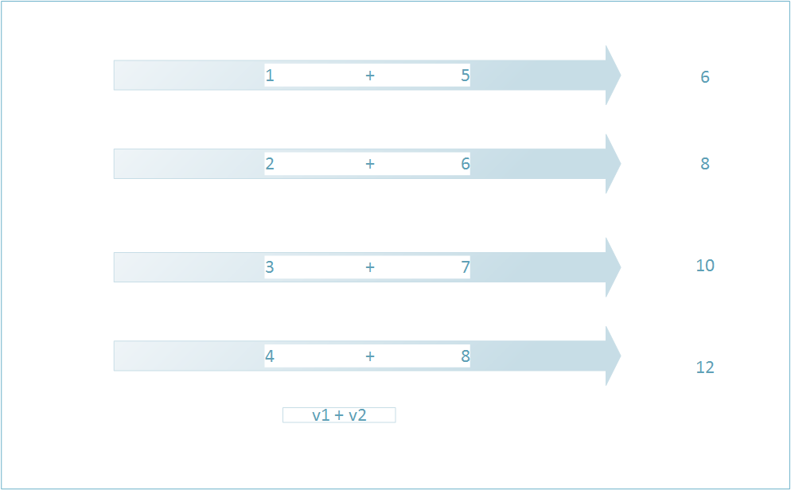
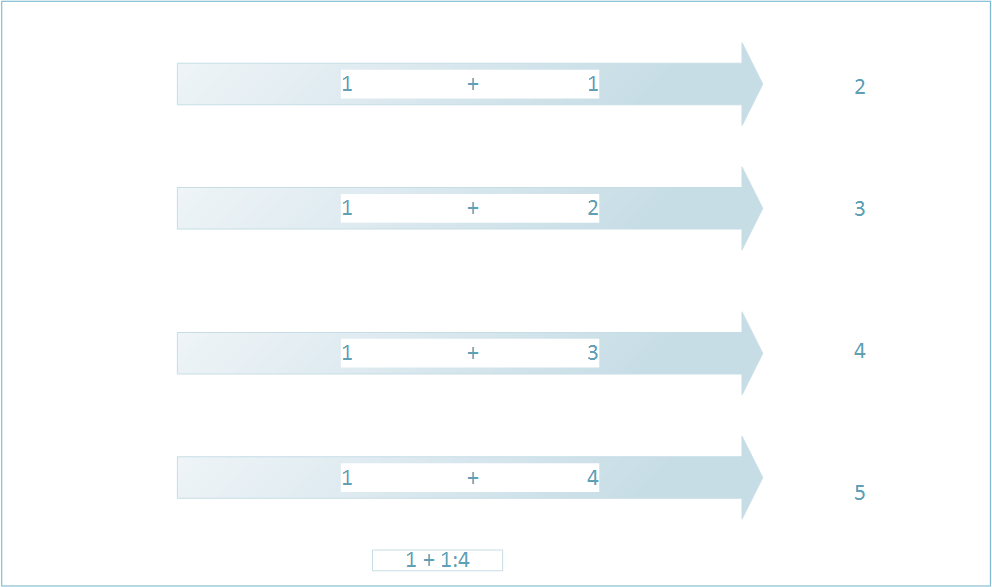
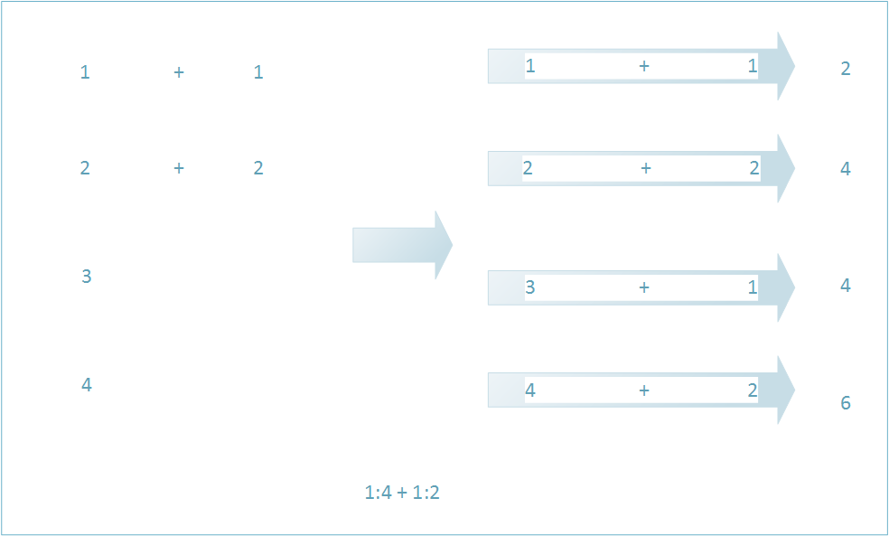

### Vectores


El tipo más básico de estructura de dato en R es el _vector_. El vector es una estructura 
compuesta de un número de elementos finitos, homogéneos y donde dicha estructura
tiene un tamaño fijo. Finito porque existe un último elemento; homogéneo porque
todos los elementos son del mismo tipo y tamaño fijo porque el tamaño del vector
debe ser conocido en tiempo de ejecución o compilación.


#### Creación de Vectores {#creacion}

Los vectores atómicos pueden ser creados con la función `c()`, que corresponde
a la sigla de _combinar_:


```r
vector_double <- c(1, 2.5, 4.5)
# Con el sufijo L, conseguimos un integer en lugar de un double
vector_integer <- c(1L, 6L, 10L)
# Usamos TRUE y FALSE (o T y F) para crear vectores lógicos
vector_logical <- c(TRUE, FALSE, T, F)
vector_character <- c("Hola", "Mundo!")
```


La función `vector()` crea un vector de un tipo y longitud que debemos especificar
en el momento de su declaración:


```r
vector_double <- vector(mode = "double", length = 3)
vector_integer <- vector(mode = "integer", length = 3)
vector_logical <- vector(mode = "logical", length = 4)
vector_character <- vector(mode = "character", length = 2)
```

Otra posibilidad es hacer uso de las funciones _wrapper_ (del inglés, envoltorio) que
existen para cada tipo de datos. Las siguientes instrucciones son equivalentes a
las anteriores:


```r
vector_double <- double(3)
vector_integer <- integer(3)
vector_logical <- logical(4)
vector_character <- character(2)
```


Además, mediante el operador `:` podemos generar sucesiones de números:


```r
1:10
##  [1]  1  2  3  4  5  6  7  8  9 10
15:11
## [1] 15 14 13 12 11
1:10 - 1
##  [1] 0 1 2 3 4 5 6 7 8 9
1:(10 - 1)
## [1] 1 2 3 4 5 6 7 8 9
```

También podemos usar las funciones `seq()` y `rep()`:


```r
seq(10) # mismo efecto que 1:10
##  [1]  1  2  3  4  5  6  7  8  9 10
seq(3, 10) # mismo efecto que 3:10
## [1]  3  4  5  6  7  8  9 10
seq(1, 10, by=3) #saltando de 3 en 3
## [1]  1  4  7 10
```


```r
rep(1:4, 2) #repetimos 1:4 dos veces
## [1] 1 2 3 4 1 2 3 4
rep(1:4, each=2) #repetimos 1:4 dos veces, intercalando resultado
## [1] 1 1 2 2 3 3 4 4
```


#### Longitud {#longitud}

Todos los vectores tienen dos propiedades:

- Un _tipo_, que se puede determinar con la función `typeof()`:


```r
typeof(letters)
## [1] "character"
typeof(1:10)
## [1] "integer"
```

- Una _longitud_, que nos dice cuantos elementos contiene el vector. Podemos
conocer este valor mediante la función `length()`:


```r
v <- c(1, 2, 3)
length(v)
## [1] 3
length(c(TRUE, FALSE, NA))
## [1] 3
```


Una posible fuente de confusión es cuando trabajamos con vectores de tipo character.
Con este tipo de vector, la longitud es el número de strings, no el número de caracteres
en cada string. Para esto último, utilizaremos la función `nchar()`:


```r
alumnos <- c("Juan", "Pepe", "Maria", "Dolores")
length(alumnos)
## [1] 4
nchar(alumnos)
## [1] 4 4 5 7
```


#### Tipos Fundamentales de Vectores Atómicos {#tipos}

Los cuatro tipos más importantes de vectores atómicos son:

- Logical
- Integer
- Double (conocidos por numeric)
- Character

Cabe mencionar que existen los tipos complex y raw que son raramente
utilizados en el análisis de datos, es por eso que no los trataremos en este texto.


##### Logical {#logical}

Los vectores lógicos son  el tipo más simple de vector atómico puesto que sólo pueden
tomar tres posibles valores `TRUE`, `FALSE` y `NA`. Los vectores lógicos usualmente
son el resultado de expresiones con los operadores lógicos y de comparación. 

```r
1 : 10 %% 3 == 0
##  [1] FALSE FALSE  TRUE FALSE FALSE  TRUE FALSE FALSE  TRUE FALSE
```

Para mas información sobre la sintaxis de los operadores y su precedencia consultar la
documentación R: 


```r
# Sintaxis de los operadores y su precedéncia
help("Syntax", "base")
# Operadores lógicos
help("Logic", "base")
```


##### Numeric {#numeric}

Los vectores de tipo integer y double son en R vectores de tipo numeric.
En R, los números son double por defecto. Si queremos un integer, añadiremos la letra
`L` después del número:


```r
typeof(1)
## [1] "double"
typeof(1L)
## [1] "integer"
1.5L
## [1] 1.5
```

##### Character {#character}

Los vectores de tipo character son aquellos en los que cada elemento del vector es un 
_string_ (cadena de caracteres):


```r
titulo <- "Ciencia de datos en R"
```

#### Manipulación de Vectores Atómicos {#manipulacion}

Ahora que ya conocemos los diferentes tipos de vectores atómicos, pasamos a ver
a continuación las diferentes herramientas para trabajar con ellos. En concreto
veremos:


- Cómo conocer si un objeto es un tipo específico de vector.
- De qué modo convertir de un tipo a otro, y cuándo sucede de forma automática.
- De qué manera dar nombre a los elementos de un vector.
- Conocer el significado de las operaciones vectorizadas y hacer uso de las mismas.
- Qué sucede cuando trabajamos con vectores de diferentes longitud.
- Cómo seleccionar partes o elementos de un vector.

##### Funciones para Comprobar el tipo

En ocasiones queremos realizar diferentes cosas basadas en el tipo de vector. Una 
opción es usar la función `typeof()`. Otra es usar las funciones que realizan la
comprobación de tipo y devuelven `TRUE` o `FALSE`, como `is.character()`, `is.double()`, 
`is.integer()`, `is.logical()` o, de forma más general mediante `is.atomic()`:


```r
vector_integer <- c(1L, 2L, 3L)
typeof(vector_integer)
## [1] "integer"
is.integer(vector_integer)
## [1] TRUE
is.atomic(vector_integer)
## [1] TRUE
```


```r
vector_double <- c(1, 2.5, 4.5)
typeof(vector_double)
## [1] "double"
is.double(vector_double)
## [1] TRUE
is.atomic(vector_double)
## [1] TRUE
```


Es importante subrayar que la función `is.numeric()` comprueba si un objeto es de
tipo numeric y devuelve `TRUE` tanto para vectores de tipo integer como de tipo 
double. 


```r
is.numeric(vector_integer)
## [1] TRUE
is.numeric(vector_double)
## [1] TRUE
```


En la siguiente tabla resumimos las funciones para comprobar el tipo de nuestros
vectores:

|  | logical | integer | double | character | list |
| :--- | :---: | :---: | :---: | :---: | :---: |
| **is.logical\(\)** | X |  |  |  |  |
| **is.integer\(\)** |  | X |  |  |  |
| **is.double\(\)** |  |  | X |  |  |
| **is.numeric\(\)** |  | X | X |  |  |
| **is.character\(\)** |  |  |  | X |  |
| **is.atomic\(\)** | X | X | X | X |  |
| **is.list\(\)** |  |  |  |  | X |
| **is.vector\(\)** | X | X | X | X | X |

_Tabla 2 Funciones comprobación de tipos_


##### Coerción {#coercion}

Todos los elementos de un vector deben ser del mismo tipo, así pues cuando intentemos
combinar diferentes tipos estos serán convertidos al tipo más flexible. El orden es el
siguiente:

    logical < integer < double < character
    
Por ejemplo, mezclar un character y un integer producirá un character:


```r
v <- c("a", 1)
v
## [1] "a" "1"
typeof(v)
## [1] "character"
class(v)
## [1] "character"
```


Cuando un vector lógico es convertido a un integer o double, `TRUE` es cambiado a
1 y `FALSE` a 0:


```r
v <- c(FALSE, FALSE, FALSE)
as.numeric(v)
## [1] 0 0 0
```

 
La coerción sucede normalmente de forma automática. La mayoría de funciones matemáticas
(`+`, `log`, `abs`, etc.) convierten a los tipos double o integer, y la mayoría de 
operaciones lógicas (`&`, `|`, `any`, etc.) cambian al tipo logical. Si el cambio de un
tipo en otro pierde información, R nos lo advertirá mediante un mensaje. 

##### Nombres de los Elementos {#nombres-de-los-elementos}

Una gran característica de los vectores en R es que podemos asignar a cada elemento un
nombre. Etiquetar los elementos hace nuestro código mas legible. Podemos especificar
los nombres cuando creamos un vector con la forma `nombre = valor`: 


```r
c(manzana = 1, platano = 2, kiwi = 3)
## manzana platano    kiwi 
##       1       2       3
```

Podemos añadir nombres a los elementos de un vector después de su creación con la 
ayuda de la función `names()`:


```r
frutas <- 1:4
names(frutas) <- c("manzana", "platano", "kiwi")
frutas
## manzana platano    kiwi    <NA> 
##       1       2       3       4
```

Gracias a la función `names()` podemos conocer los nombres de un vector:


```r
names(frutas)
## [1] "manzana" "platano" "kiwi"    NA
```

Por último, si un vector no tiene nombres, la función `names()` devuelve `NULL`:


```r
names(1:4)
## NULL
```

##### Operaciones Vectorizadas {#operaciones-vectorizadas}

La mayoría de las operaciones en R son _vectorizadas_, esto es que un operador o una
función actúa en cada elemento de un vector sin la necesidad de que tengamos
que escribir una construcción iterativa. Esta característica nos permite escribir un código más 
eficiente, conciso y mas legible que en otros lenguajes de programación.

El ejemplo mas simple es cuando sumamos dos vectores:


```r
v1 <- 1:4
v2 <- 5:8
v3<- v1 + v2
v3
## [1]  6  8 10 12
```


Cuando usamos dos o mas vectores en una operación, R alineará los vectores y llevará
a cabo una secuencia de operaciones individuales. En el ejemplo anterior, cuando 
ejecutamos la instrucción `v1 + v2`, R pondrá cada vector en una fila y sumará el 
primer elemento de `v1`con el primer elemento de `v2`. A continuación, sumará el 
segundo elemento del vector 1 con el segundo elemento del vector 2, y así sucesivamente,
hasta que todos los elementos se han sumado. El resultado será un vector de la misma
longitud que los anteriores, como muestra la [Figura 1]().





Sin la vectorización tendríamos que realizar la suma mediante el uso de una estructura
iterativa, como por ejemplo:


```r
v3 <- numeric(length(v1))
for(i in seq_along(v1)) {
  v3[i] <- v1[i] + v2[i]
}
v3
## [1]  6  8 10 12
```

Otro tipo de operaciones que podemos realizar de forma vectorizada son las comparaciones
lógicas. Supongamos que queremos saber que elementos en un vector son mas grandes que 2.
Podríamos hacer lo siguiente:


```r
v1 <- 1:4
v1 > 2
## [1] FALSE FALSE  TRUE  TRUE
```

A continuación, mostramos otros ejemplos de operaciones vectorizadas de tipo lógico:


```r
v1 <- 1:4
v1 >= 2
## [1] FALSE  TRUE  TRUE  TRUE
v2 < 3
## [1] FALSE FALSE FALSE FALSE
v3 == 8
## [1] FALSE  TRUE FALSE FALSE
```

Desde luego, la resta, multiplicación y división son también operaciones vectorizadas:


```r
v1 - v2
## [1] -4 -4 -4 -4
v1 * v2
## [1]  5 12 21 32
v1 / v2
## [1] 0.2000000 0.3333333 0.4285714 0.5000000
```

##### Reciclado de Vectores y Repetición {#reciclado-de-vectores-y-repeticion}

En los ejemplos anteriores hemos realizado operaciones aritméticas con vectores
de la misma longitud. No obstante podríamos estar preguntándonos, "¿Qué sucede si
intentamos realizar operaciones en vectores de diferente longitud?".


Si intentamos realizar la suma de un único número (escalar) a un vector, entonces el número
es sumado a cada elemento en el vector, como muestra la [Figura 2]():


```r
1:5 + 1
## [1] 2 3 4 5 6
```




Cuando sumamos dos vectores de diferente longitud, R reciclará los elementos del vector 
más pequeño para que coincida con el más grande, como podemos ver en la [Figura 3]():


```r
1:2 + 1:4
## [1] 2 4 4 6
```




Si la longitud del vector más grande no es múltiple con la longitud del vector más
pequeño, R nos lo hará saber mediante un mensaje:


```r
1:5 + 1:7
## Warning in 1:5 + 1:7: longer object length is not a multiple of shorter
## object length
## [1]  2  4  6  8 10  7  9
```


Aunque R nos permita realizar operaciones con vectores de diferente longitud, esto
no significa que nosotros deberíamos hacerlo. Realizar una suma de un valor escalar
a un vector es coherente, pero realizar operaciones con vectores de diferente 
longitud puede llevarnos a errores. Es por eso, que recomendamos crear explícitamente
vectores de la misma longitud antes de operar con ellos.

La función `rep()` es muy útil para esta tarea, permitiéndonos crear un vector con 
elementos repetidos:


```r
rep(1:5, 3)
##  [1] 1 2 3 4 5 1 2 3 4 5 1 2 3 4 5
rep(1:5, each = 3)
##  [1] 1 1 1 2 2 2 3 3 3 4 4 4 5 5 5
rep(1:5, times = 1:5)
##  [1] 1 2 2 3 3 3 4 4 4 4 5 5 5 5 5
```


```r
rep(1:5, length.out = 7)
## [1] 1 2 3 4 5 1 2
# Alternativamente podemos hacerlo mediante rep_len (desde v3.0.0)
rep_len(1:5, 7)
## [1] 1 2 3 4 5 1 2
```

##### Selección de Elementos {#seleccion-de-elementos}


En ocasiones queremos acceder a una única parte de un vector, o quizá a un único
elemento. Esto es conocido como _indexing_ (del inglés, indexación) y se realiza
mediante el uso de los corchetes `[]`. Existen cuatro maneras diferentes de elegir
una parte de un vector:

- Mediante un vector numérico de tipo integer. Los integers deben ser todos positivos,
todos negativos, o cero.

 Seleccionar los elementos con integers positivos extrae los elementos de las posiciones indicadas:
  

```r
v <- c("uno", "dos", "tres", "cuatro", "cinco")
v[c(3, 2, 5)]
## [1] "tres"  "dos"   "cinco"
```

  Repitiendo una posición, podemos obtener un vector de una longitud más grande que
el vector original:
  
  

```r
v[c(1, 1, 5, 5, 5, 2)]
## [1] "uno"   "uno"   "cinco" "cinco" "cinco" "dos"
```

  
  Los valores negativos eliminan los elementos en las posiciones especificadas:
  
    

```r
v[c(-1, -3, -5)]
## [1] "dos"    "cuatro"
```

  
  No podemos mezclar valores positivos y negativos:
  

  

```r
v[c(1, -1)]
```


- Por medio de un vector lógico obtenemos todos los valores correspondientes
al valor `TRUE`. Este tipo es útil en conjunción con la funciones de comparación:


```r
v <- c(10, 3, NA, 5, 8, 1, NA)
# Devuelve todos los valores que no son NA en x
v[!is.na(v)]
## [1] 10  3  5  8  1
```


```r
# Todos los valores pares (o desconocidos) en x
v[v %% 2 == 0]
## [1] 10 NA  8 NA
```


- Si hemos dado nombres a los elementos de nuestro vector, podemos seleccionar
sus elementos con un vector de tipo character:


```r
frutas <- c(manzana = 1, platano= 2, kiwi=3, pera=4, naranja=5)
frutas[c("platano", "naranja")]
## platano naranja 
##       2       5
```

- Mediante `v[]`, obtendremos el vector completo:


```r
v <- c(10, 3, NA, 5, 8, 1, NA)
v[]
## [1] 10  3 NA  5  8  1 NA
```
 
 Esta notación no es muy útil para acceder a vectores, sin embargo nos será de 
 gran ayuda en el acceso a [matrices](../matrices/matrices.Rmd) (y cualquier tipo 
 de estructura multidimensional) puesto que nos permite seleccionar todas las filas 
 o columnas. Por ejemplo, si _x_ es _2D_, `v[1, ]` selecciona la primera fila y todas 
 las columnas, y `v[, -1]` recupera todas las filas y columnas excepto la primera.
  
 
##### Resumen {#resumen}

- Los vectores tienen una longitud que podemos conocer o definir mediante la función
`length()`.
- La función `seq()` y sus variantes nos permite crear sucesiones de números.
- Podemos dar nombre a los elementos de un vector en el momento de su creación o
una vez creado mediante la función `names()`.
- Podemos acceder a los elementos de un vector mediante los `[]` y un índice. La
función `rep()` nos permite crear vectores con elementos repetidos.
  
  
